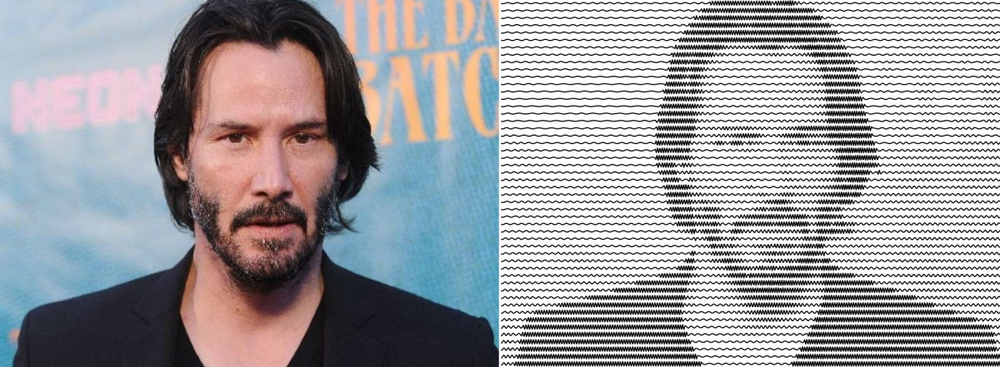

# 50 Lines Bot

Telegram-bot that redraws your images using just 50 lines. Forked from [@Loskir/50-lines-bot](https://github.com/Loskir/50-lines-bot) to optimize for Deta. Original idea by u-ndefine: [gist](https://gist.github.com/u-ndefine/8e4bc21be4275f87fefe7b2a68487161).  

Bot itself: [@Lines50Bot](https://t.me/Lines50Bot)  
See also: [Web version](https://loskir.github.io/50-lines), [Realtime webcam version](https://loskir.github.io/50-lines-webcam)  
Loskir's channel: [@Loskirs](https://t.me/Loskirs)  
Misha's channel: [@FilteredInternet](https://t.me/FilteredInternet)
